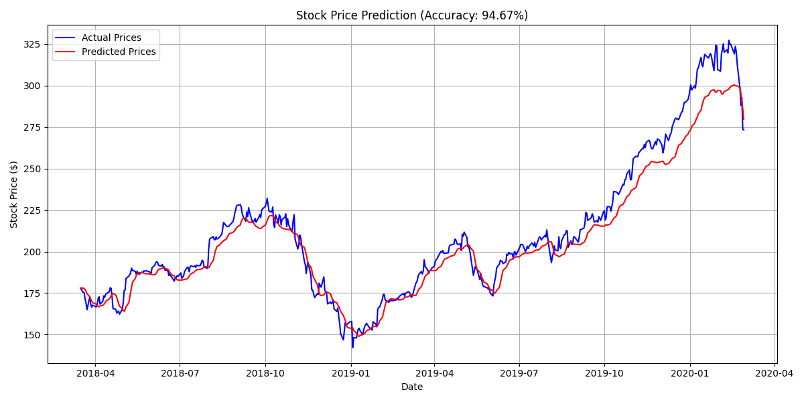

# Stock Price Predictor

## Overview

The Stock Price Predictor is a machine learning solution that leverages time-series deep learning techniques to forecast stock prices.

## Project Purpose and Problem Statement

Stock market prediction is inherently challenging due to volatility and noise. Stock price prediction involves forecasting the future price of a stock based on historical data and relevant market information. Accurate predictions can enable investors to make informed decisions and optimize their portfolios. However, predicting stock prices is particularly complex due to factors such as:

- **Market Volatility:** Stock prices fluctuate rapidly due to news events, investor sentiment, and economic indicators.
- **Non-linearity:** Price movements do not follow a straightforward pattern, making traditional linear models insufficient.
- **External Influences:** Geopolitical events, interest rates, and even social media trends can significantly impact stock prices.

To address these challenges, the project leverages Long Short-Term Memory (LSTM) networks, a type of recurrent neural network (RNN) known for effectively capturing sequential dependencies in time-series data.

## Key Techniques

- **Time-Series Analysis:** Involves processing sequential stock data to identify patterns and trends over time. This includes sorting data chronologically and transforming it for model input.

- **Long Short-Term Memory (LSTM) Networks:** A specialized type of Recurrent Neural Network (RNN) designed to handle long-term dependencies in sequential data. LSTMs address the vanishing gradient problem common in traditional RNNs by using gating mechanisms that control the flow of information. This makes them well-suited for capturing complex patterns in stock prices.

- **Early Stopping in Training:** Implements callback strategies to monitor validation loss during training. If performance on the validation set stops improving, training is halted to prevent overfitting and retain the best-performing model.

- **Data Scaling & Preprocessing:** Uses Min-Max scaling to normalize data features to a range of 0 to 1, enhancing model performance and convergence speed. Additionally, volume data is converted to a numeric format, and key financial features such as open, close, high, and low prices are selected for analysis.

## Dataset Details

This project uses a historical stock dataset sourced from Kaggle: [Apple AAPL Historical Stock Data](https://www.kaggle.com/datasets/tarunpaparaju/apple-aapl-historical-stock-data). The dataset includes:

- **Data Source:** Kaggle
- **Data Size:** Contains daily stock data from 2010 to the present, encompassing over a decade of trading information.
- **Features Included:**
  - Date
  - Open
  - High
  - Low
  - Close
  - Volume
- **Preprocessing Steps:**
  - Converting volume data to a numeric format.
  - Sorting records chronologically by date.
  - Selecting relevant features: closing price, volume, opening price, high, and low.
  - Scaling features to a normalized range for improved model performance.

## Visualization Feature

This visualization provides an immediate, clear comparison of model performance at its current stage.

## Future Improvements

To enhance the model's accuracy and robustness, the following improvements are being considered:

- **Experiment with Advanced Architectures:** Exploring more sophisticated neural network architectures like Transformer models, which have shown promise in capturing complex patterns in sequential data.
- **Hyperparameter Optimization:** Implementing automated hyperparameter tuning methods, such as grid search or Bayesian optimization, to identify optimal model parameters.
- **Ensemble Methods:** Combining predictions from multiple models to reduce variance and improve generalization.
